# OTFToolBox

TheraForge ToolBox (*OTFToolBox*) is an open software development kit (SDK) for rapid application development (RAD) of digital health solutions running on Apple iOS.

It comprises a set of iOS frameworks for students, researchers and professional developers, designed to accelerate rapid prototyping of digital health applications.

OTFToolbox includes support for persistent secure local storage with cloud synchronization and *offline-first capabilities*, digital health UI/UX components synchronized with data changes, support for powerful app templating and styling, REST API support to connect to TheraForge's secure CloudBox service, AppleWatch support, wearable device support as health data sources, and much more.

## Change Log
<details open>
  <summary>Release 1.0.3-beta</summary>
  <ul>
    <li>Added Watch OS support</li>
  </ul>
</details>

<details>
<summary>Release 1.0.1-beta</summary>
<ul>
<li>Removed warnings and made various other improvements in the sub-frameworks. Verified support for Xcode 13.3. Improved dependency diagram and formatting in the Readme</li>
</ul>
</details>

<details>
<summary>Release 1.0.0-beta</summary>
<ul>
<li>First beta release of the framework</li>
</ul>
</details>


# Table of Contents
* [Overview](#Overview)
* [Features](#Features)
* [Installation](#Installation)
* [Cloud Setup](#Cloud-Setup)
* [Cloud Analytics Portal](#TheraForge-Analytics)
* [No-code App Customization](#Customization)
* [OTFToolbox Subspecs](#OTFToolbox-Subspecs)
* [OTFToolBox Dependency Diagram](#Dependency)
* [OTFToolBox File Protection](#FileProtection)
* [License](#License)

# Overview <a name="Overview"></a>

OTFToolBox is a client-side frontend SDK comprising several components:

* A cloud client framework for interconnection to TheraForge’s CloudBox serverless service (BaaS): [OTFCloudClientAPI](../../../OTFCloudClientAPI)
* Enterprise-grade digital health frameworks: [OTFCareKit](../../../OTFCareKit), [OTFResearchKit](../../../OTFResearchKit)
* Enterprise-grade persistent storage and synchonization frameworks: [OTFCloudantStore](../../../OTFCloudantStore), [OTFCDTDatastore](../../../OTFCDTDatastore)
* A templating framework for app customization and styling: [OTFTemplateBox](../../../OTFTemplateBox)


In reality, OTFToolBox is the top-level “umbrella” framework that includes all of the above sub-frameworks. So it represents the entire “ToolBox SDK”.

OTFToolBox also enables apps to connect to a secure cloud service, **TheraForge CloudBox**, which supports encrypted data storage in compliance with GDPR and HIPAA requirements as well as data synchronization and offline-first app behavior. CloudBox works similarly to cloud services such as Dropbox but for app data.

CloudBox also supports a configurable web-based dashboard for doctors and patients, as well as a detailed analytics dashboard for backend monitoring.

The setup process of ToolBox and of a CloudBox account is described in the sections below.

For more information on the TheraForge SDK and cloud services, you can send an email to info@hippocratestech.com .

# ToolBox Features <a name="Features"></a>

The TheraForge ToolBox SDK supports the following features:

* No-code app customization and configuration
  * Powerful styling capabilities
  * SF Symbols support
* Support for dark mode, dynamic font sizes, high contrast, and other accessibility features
* Customizable *no-code template app*: **[MagicBox](../../../OTFMagicBox)**
* **ResearchKit** support
  * App onboarding
  * Informed consent
  * Surveys
  * Medical task-based assessments
* **CareKit** support
  * Virtual care/tele-medicine capabilities for remote care plan management
  * Adherence tracking
  * FHIR support
  * Standard UI cards and styles
* **HealthKit** support
  * Monitoring of health data
  * External sensor support
  * FHIR support
  * Conditional inclusion only when needed by app
* **CloudBox** support (AWS, IBM HyperProtect (future))
  * REST APIs
  * *Offline-first* local storage (not just a cache)
  * Multi-device synchronization
  * Robust data versioning
  * Automatic data storage in the cloud
  * Notification protocol based on Server-Sent Events (SSE) technology
  * *HIPAA and GDPR compliant* encryption at rest and in flight (TLS 1.3)
  * *HIPAA and GDPR compliant* authentication
  * Sign in with Apple and with Google
  * Passwordless sign-in based on TouchID or FaceID
  * SSL Pinning
  * Prometheus-based analytics dashboard
  * SonarQube-based code security analysis
* Cocoapods support

# Installation <a name="Installation"></a>

* [Prerequisites](#Prerequisites)
* [Project Setup](#Project-Setup)

## Prerequisites <a name="Prerequisites"></a>

An Intel-based Mac running [macOS Catalina 10.15.4 or later](https://developer.apple.com/documentation/xcode-release-notes/xcode-12-release-notes) or a Mac with Apple's M1 Silicon running [macOS 11 Big Sur](https://developer.apple.com/documentation/xcode-release-notes/xcode-12_2-release-notes). macOS 12 Monterey and Xcode 13 are supported.

If you want to learn more about iOS Development, you may want to check out the free Stanford class here: https://cs193p.sites.stanford.edu

### 1. Installation Prerequisites

In order to develop iOS apps, make sure to download Xcode, Apple's Integrated Development Environment (IDE), from the Mac App Store.

If you haven't done it yet, follow this [Xcode article](https://medium.nextlevelswift.com/install-and-configure-xcode-7ed0c5592219) to install and configure it.

(Note that in case of Xcode 13.2 Apple recommends to download it directly from the Apple Developer web site https://developer.apple.com/download/all/?q=Xcode. Some developers consider this installation method *preferable for all versions of Xcode*, that is, it’s considered a best practice. However, in this case you also need to install the *Command Line Tools for Xcode*, which are a separate download.)

After installing the Xcode app, you will also need to install the [CocoaPods](https://cocoapods.org/) dependency manager for Swift and Objective-C Cocoa projects.

If you are new to CocoaPods you can refer to the [CocoaPods Guides](https://guides.cocoapods.org/using/using-cocoapods.html) to learn more about it.

CocoaPods is built with the Ruby language and can be installed with the default version of Ruby available with macOS.

However, before installing CocoaPods, we recommend that you also install the [Homebrew](https://brew.sh/) package manager. Refer to our [Homebrew Installation](Docs/Homebrew.md) page for prerequisites and caveats.

To do that, open the Terminal application (you can type ⌘+spacebar to bring up the macOS Spotlight search, enter `Terminal` in it, and then press Return).

Then type the following command in Terminal:

```
/bin/bash -c "$(curl -fsSL https://raw.githubusercontent.com/Homebrew/install/HEAD/install.sh)"
```

as explained in the [Homebrew](https://brew.sh/) main page. (If you get an error, check out our [Homebrew Installation](Docs/Homebrew.md) page.)

Wait for the installation to end.

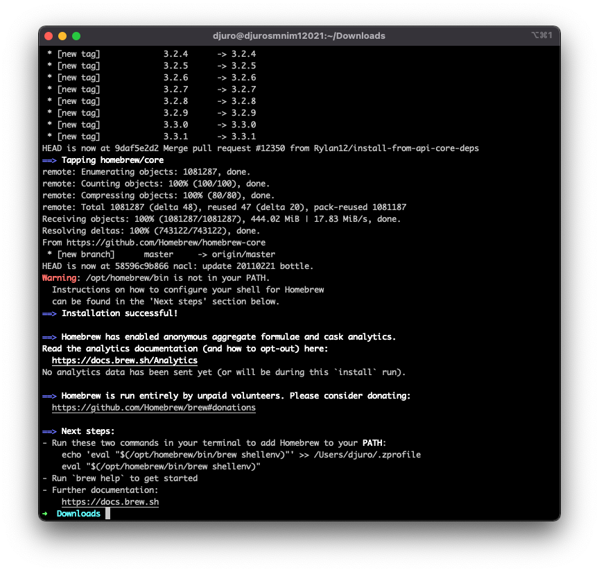

OTFToolBox by default includes Apple's ResearchKit framework. Building it requires the installation of the `git-lfs` tool like so:

```
brew install git-lfs
```

Finally, to install Cocoapods in Terminal enter:

```
sudo gem install cocoapods
```

as shown below:

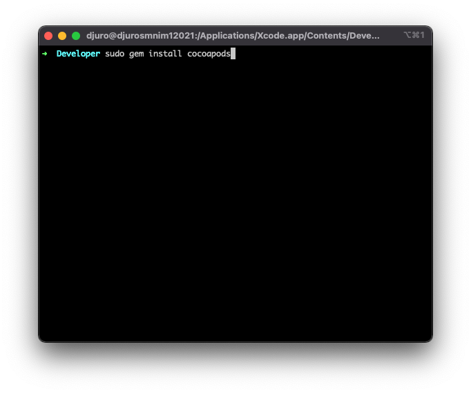

Refer to our [Cocoapods Installation](Docs/Cocoapods.md) page for prerequisites, caveats and troubleshooting suggestions.

After successful installation of `git-lfs` and Cocoapods, you can start creating your Xcode project.

## Project Setup <a name="Project-Setup"></a>

### 2. Create an Xcode project

#### 2.1 Create a Project Sub-directory in the *Developer* Directory

You need to create a project directory in your user directory.

For example, in `Terminal` go to your personal directory by typing this command:

```
cd ~
```
In the Finder that corresponds to your home directory (the one with the home icon and your username).

The canonical way to store software development projects is by creating a ~/Developer sub-directory.
The Finder has a special "hammer" icon just for this sub-directory (that you can also add to the sidebar):

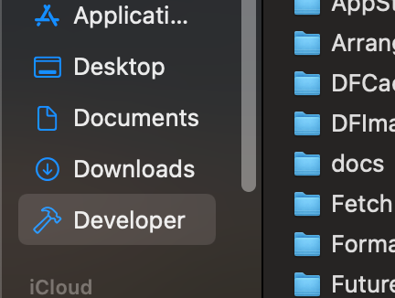

So go ahead and create a “Developer” directory (if you haven’t done it already) in the Finder or in Terminal like so:

```
mkdir Developer
```

This directory will be used to add projects to it.

#### 2.2 Add an Existing Project

**Note:** The TheraForge SDK supports pre-packaged template applications that can be downloaded and installed directly.

**MagicBox** is TheraForge’s main template app that can be downloaded and customized to create quick protypes in just a few hours.

If you’d like to use MagicBox (for example if you are not very experienced with development), then go to the Readme file of [OTFMagicBox](../../../OTFMagicBox) and proceed with the installation from there.

In any case, it may be convenient to install MagicBox as a model app for reference.

If you wish to use only the SDK, instead, then proceed with the process below to create a new project.

#### 2.3 Create a Brand New Project

For example, you may want to call your new project *MyDigitalHealthApp*.

So launch Xcode (you can search for “Xcode” in Spotlight and press Return).

Then select **Create new project**. Name your project **MyDigitalHealthApp** as shown below: 

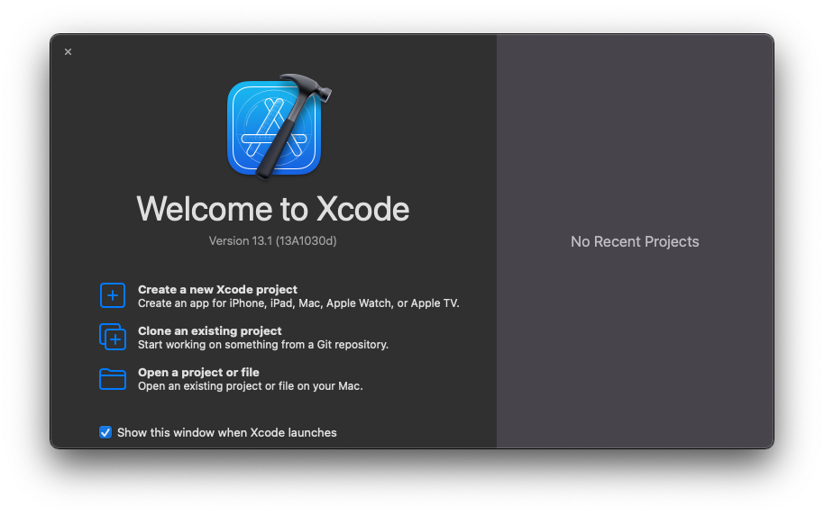

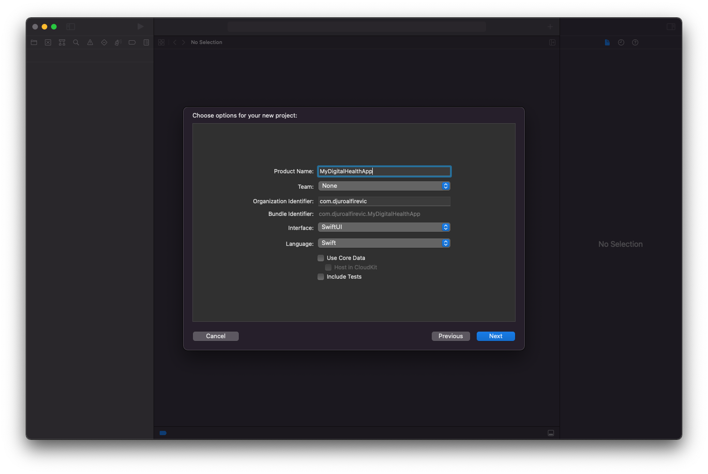

Feel free to pick either **Storyboard** or **SwiftUI** type.

Then, make sure sure to select the **Developer** folder as location for your new project.

Voilà. Xcode will create a sub-folder called *MyDigitalHealthApp* with the basic project files.

### 3. Initialize CocoaPods

After creating the project, head back to the Terminal app and go to the MyDigitalHealthApp folder (type `cd MyDigitalHealthApp` where you originally created the project). After that run the `pod init` command:

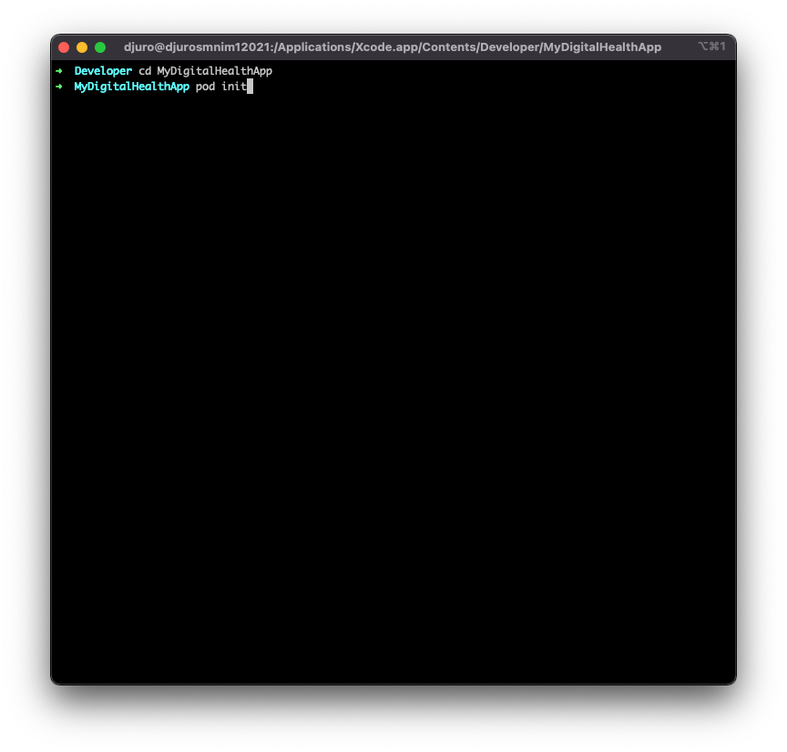

This command will create a file named **Podfile** inside your MyDigitalHealthApp folder:

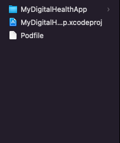

Once your project podfile is created, you can start adding required modules under the targets in this file.

### 4. Module (a.k.a. Pod) installation

Open the Podfile in your favourite text editor (for example, using Xcode or TextEdit). The content of that file should look like the following text:

```ruby
# Uncomment the next line to define a global platform for your project
# platform :ios, '9.0'

target 'MyDigitalHealthApp' do
  # Comment the next line if you don't want to use dynamic frameworks
  use_frameworks!

  # Pods for MyDigitalHealthApp

end
```

In the file, you need to add two things:

1. You need to add two sources at the top to tell Cocoapods where to search for the modules to install:
   ```ruby
   source 'https://cdn.cocoapods.org'
   source 'https://github.com/Theraforge/OTFCocoapodSpecs’
   ```
2. You also need to specify that you want to install the OTFToolBox parent framework/module like so:
   ```ruby
   pod 'OTFToolBox'
   ```

The latter installs all the TheraForge frameworks through a common parent framework.

(If you wish to integrate specific TheraForge frameworks then please check [OTFToolbox subspecs](#OTFToolbox-subspecs) for more detailed installation.)

Then, your file should look like this:

```ruby
# Uncomment the next line to define a global platform for your project
# platform :ios, '9.0'
source 'https://cdn.cocoapods.org'
source 'https://github.com/Theraforge/OTFCocoapodSpecs’

target 'MyDigitalHealthApp' do
  # Comment the next line if you don't want to use dynamic frameworks
  use_frameworks!

  # Pods for MyDigitalHealthApp
  pod 'OTFToolBox'
end
```

Head back to the `Terminal` window after saving the file and run:

```ruby
pod install
```

Then you should see the modules getting installed like so:

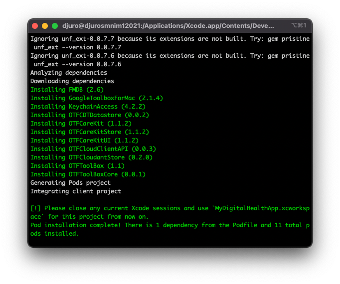

After successful completion of the installation process (be patient, sometimes it make take several minutes), your folder structure should look like the one in the following image:

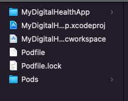

### 5. Compile & Run

Make sure not to open the `MyDigitalHealthApp.xcodeproj` file but, instead, you should always open the `MyDigitalHealthApp.xcworkspace` file (which is what Cocoapods altered).

Your Xcode app window should look like this:

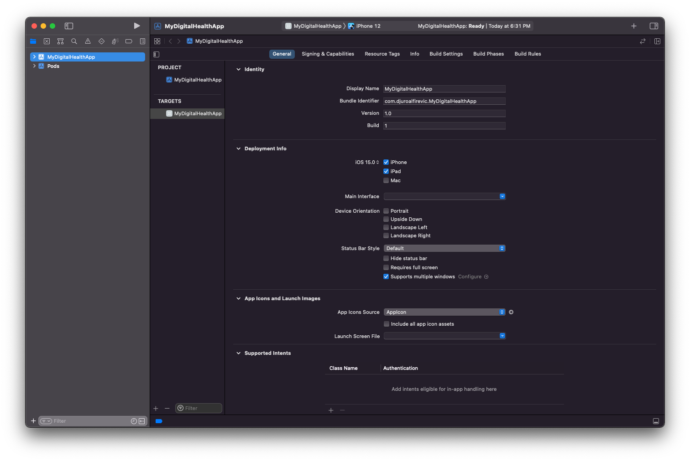

Type `Cmd + B` or click on the **Product** -> **Build** menu item to build the project.

You may want to select a specific iPhone model from the dropdown menu before building.

Make sure that it's compiling without any errors:

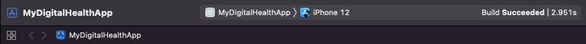

Now you are ready to rock!


If you wish to integrate specific TheraForge frameworks then please check the [OTFToolbox subspecs](#OTFToolbox-subspecs) for more detailed installation information.


# TheraForge Cloud Setup <a name="Cloud-Setup"></a>

The TheraForge Secure Cloud service is a shared hosting BaaS that provides cloud connectivity and synchronization to apps (and much more).
In order to use it in their apps, clients need to register an account with the minimal information that is required by the backend services.

We divided the registration process in two parts: the first one is the <b>Client Registration</b> and the second one is the <b>API Key Registration</b>.

## Client Registration <a name="Client-Registration"></a>

To sign up for the TheraForge Secure Cloud service, use the TheraForge Client Registration form available here: 
[Client-Registration-Form](https://docs.google.com/forms/d/e/1FAIpQLSfYDEx-Cnja_YE6iUFs08pxxLThlV76TAJ2uB7ymuUXbky9iA/viewform).

The Client Registration form requires some basic information about the client's organization. This is the list of the input fields that are presented in the form:

1. Company Name (Required)
2. Company Email Address (Required)
3. Contact Name (Required)
4. Contact Email Address (Required)
5. Contact Phone Number (Optional)
6. Let us know about your work (Required)

Once you submit the form, our *support team* will review the information provided and then they will guide you on the subsequent steps to complete the API key registration process.

## API Key Registration and Backend Configuration Information <a name="Key-Registration"></a>

After successful submission of the *Client Registration* form, you will be contacted to go through the API key registration process via a setup form.

This is the list of the input fields that are shown in the backend setup form:

1. Company Developer Email Address (Required): It represents the contact information to which an API Key will be associated.
2. Organization Source Email Address (Optional): The Organization Source Email address is the source address that will be used to send emails to users for general communications, for example, when they forget the access password to the dashboard.
3. Organization Email Server (Optional): An Organization Email Server address is required when the backend needs to configure the mail service for sending emails to users. Here is the format for the Organisation Email Server: **mail.organisation-domain.com**.
4. Organization Source Email Address Password (Optional): This is the password for the source email server.
5. Gmail Client ID (Optional): The Gmail client ID is used to enable the Sign in with Gmail functionality. The Gmail client ID is optional for the initial configuration.<br>
6. Apple ID (Optional): Apple ID is used to enable the Sign in with Apple functionality. The Apple ID is optional for the initial configuration.
7. Redirect URL for Sign in with Apple (Optional): The Apple Redirect URL is used in the web dashboard to redirect the user after it is authenticated by an Apple server. This URL is optional for the initial configuration.

Once you submit this setup form, our development team will review the information. Once the information is configured, then our support team will share the API key with you and will support you through any further steps to complete the backend configuration process.

## Using the Cloud Registration Information <a name="Using-Registration"></a>

Once an API key is received, the next step is to add it to the appropriate configuration file that is used by the OTFCloudClientAPI framework to establish the communication with the cloud backend.

In the app code, before creating an instance of the ``TheraForgeNetwork object, you need to create a `configurations` object with the API Key assigned to you and with the TheraForge cloud server URL like so:

```swift
let configurations = NetworkingLayer.Configurations(APIBaseURL: URL(string:"Cloud Server URL"), apiKey: "Your API_KEY")
TheraForgeNetwork.configureNetwork(configurations)
let otfNetworkService = TheraForgeNetwork.shared
```

You can refer to the [OTFCloudClientAPI](../../../OTFCloudClientAPI) Readme file and review the documentation in which the configuration and other steps are discussed in detail.

## Rebuild the App Using the Cloud Registration Information <a name="Rebuild-After-Registration"></a>

When you have configured your files, you can rebuild your app in Xcode by clicking the Build command in the menu bar. Now your app will be running with your organisation's API Key. You can now sign up users and login into the cloud service using user-provided credentials.

# TheraForge Cloud Analytics Portal <a name="TheraForge-Analytics"></a>

The Theraforge Cloud Analytics Portal is a dashboard in which users can review their server and clients' related statistics.

Once you have configured the above parameters and have access to the cloud services, our support team will share the credentials of the analytics portal. Through these credentials you will be able to login and review the available metrics. These are the statistics that are currently available in the analytics dashboard:

1. Client Metrics: This section will show the stats related to your organization, i.e., number of users, care plan tasks, etc. <br>
2. Server Metrics: This section will show the graphs related to server stats. <br>
3. Database Metrics: This section show the HTTPD connections established with the backend database. <br>

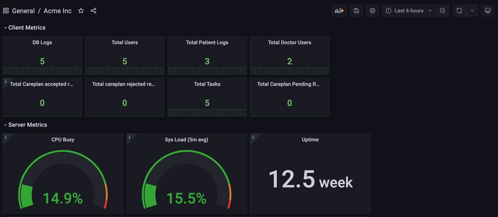 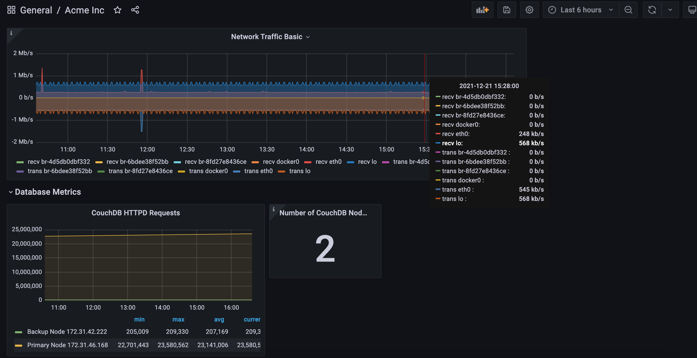

# No-code App Customization <a name="Customization"></a>

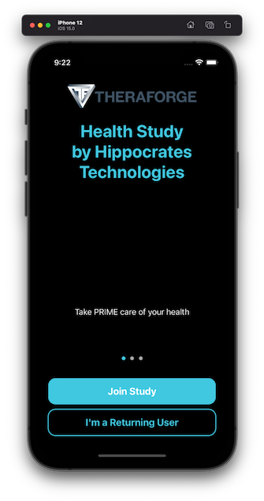 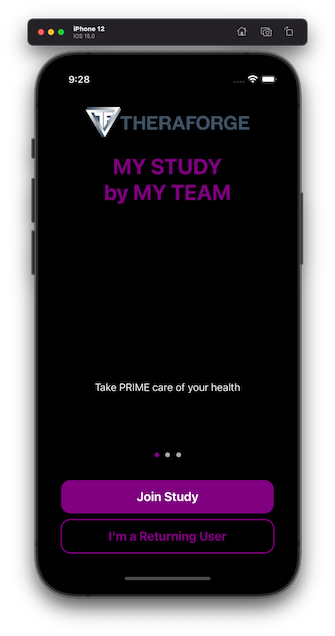

OTFToolBox leverages the [OTFTemplateBox](../../../OTFTemplateBox) framework to provide quick customization options for your digital health application through the `AppSysParameters.yml` file. This reference shows you how to customize that file to suit your needs.

The file is divided into various sections to customize different aspects of the app.

Each section contains a list of keys (which define the objects to customize) and of associated values. Every key must be associated to a value but the app will **not crash** if the value is missing or mistyped.

#### Onboarding

The *Onboarding* keys are grouped as shown below. Each group of keys is used to customize a single panel in the onboarding paging view.

|      Key      |     Values    |
| ------------- | ------------- |
| Title  | A title for the page  |
| Description | A description for the page |
| Logo  | An emoji or number for the page |

#### Consent

The values for these elements in the file will build the consent process. At least 1 section is required.

|      Consent Form Items      |   
| ------------- | 
| Title  | 
| Data Gathering |
| Privacy  | 
| Data Use  | 
| Time Commitment |
| Study Survey | 
| Study Tasks  | 
| Withdrawing |


### Application Configuration

|      Key      |     Values    |
| ------------- | ------------- |
| Login-Sign-In-With-Apple  | The title of your application  |
| Login-Passwordless  | Sign in using a passwordless setup (this process also needs to be activated on Firebase — refer to our documentation to get started)  |
| Login Step Title  | Title for logging in |
| Login Step Text  | Subtext for logging in |

|      Key      |     Values    |
| ------------- | ------------- |
| Study Title  | The title of your application  |
| Team Name  | The name of your team or department  |
| Email  | A support email for users to contact  |
| Phone  | A support phone number for users to contact |
| Copyright  | A copyright/informative statement that shows up at the bottom of the Profile view  |
| Website  | A website URL with more information about your app |
| Tint Color  | A hexadecimal color for secondary text and iconography in ResearchKit popovers (i.e. #b6133f) |
| Primary Color  | A hexadecimal color for buttons and text throughout the CardinalKit app  |
| Review Consent Step Text  | Text for consent form review |
| Consent File Name  | Name of saved consent pdf file |
| Reason for Consent Text  | Text for consent alert  |
| Passcode Text  | Text for passcode selection |
| Passcode Type  | 4 or 6: The number of numbers in the passcode |
| Completion Step Title  | Title for completing onboarding  |
| Completion Step Text  | Subtext for completing onboarding |
| Failed Login Title  | Failed Login Title |
| Failed Login Text | Subtext for failing login |
| Health Permissions Title | Access user health records using Apple's FHIRModels by setting Enabled to 1|
| Health Records  | Title for completing onboarding  |
| Health Permissions Text  | Subtext for requesting health permisions |
| Background Read Frequency  | immediate, hourly, daily, or weekly: How often to read from HealthKit data records|
| Withdrawal Instruction Title  | Title for withdrawal step |
| Withdrawal Instruction Text  | Subtext for withdrawal step |
| Withdraw Title  | Title to show after withdrawing |
| Withdraw Text | Subtext to show after withdrawing  |
| Passcode On Return Text | Text to show when user returns to app and sees passcode request |
| Consent Title | Title of consent form document |
| Use Carekit  | Enable a CareKit dashboard as a tab in the application |
| HealthKit Data to Read | A list of HealthKit Object types to read from the user (see: HealthKit Object Types)  |


---------------------------------------------------------------------------------------------------------------------------------------------------

# Additional Information for Developers

## OTFToolbox Subspecs <a name="OTFToolbox-Subspecs"></a>

OTFToolBox is the parent framework of Theraforge that includes the sub-frameworks as listed in the [Overview](#Overview).

### OTFToolBoxCore

To integrate [OTFToolBox/Core](#OTFToolBoxCore) with an existing workspace requires the extra line below in your Podfile.

Add pod 'OTFToolBox/Core' under target in Podfile.


```ruby
pod 'OTFToolBox/Core'
```

### OTFCareKit 

To integrate Theraforge [OTFCareKit](../../../OTFCareKit) requires the extra line below in your Podfile.

Add pod 'OTFToolBox/CareKit' under target in Podfile.

```ruby
pod 'OTFToolBox/CareKit'
```

### OTFCareKitUI 

To integrate OTFCareKitUI specifically which provides the views used across the framework.

Add pod 'OTFToolBox/CareKitUI' under target in Podfile.

```ruby
pod 'OTFToolBox/CareKitUI'
```

### OTFCareKitStore

To integrate OTFCareKitStore specifically which provides the solution for storing patient data across the framework.

Add pod 'OTFToolBox/CareKitStore' under target in Podfile.

```ruby
pod 'OTFToolBox/CareKitStore'
```

### OTFCloudantStore

To integrate [OTFCloudantStore](../../../OTFCloudantStore) which is a Cloudant Sync to store and query local JSON data.

Add pod 'OTFToolBox/CloudantStore' under target in Podfile.

```ruby
pod 'OTFToolBox/CloudantStore'
```

### OTFCloudClientAPI

To integrate [OTFCloudClientAPI](../../../OTFCloudClientAPI) which is a REST API SDK to connect to TheraForge Cloud.

Add pod 'OTFToolBox/API' under target in Podfile.

```ruby
pod 'OTFToolBox/API'
```

After installing the required podspec for your application you can import the integrated modules and use them in your project.


# OTFToolBox Dependency Diagram <a name="Dependency"></a>

The diagram below depicts OTFToolBox and its sub-framework dependencies:


You can also find this dependency diagram at this URL: https://docs.google.com/presentation/d/1bkPBcdUJPp1PTgaGosdCjDRqsEy3xlns4aV9RpjvlIk/edit?usp=sharing

# OTFToolBox File Protection <a name="FileProtection"></a>

There are different types of file protection levels natively available in iOS and categorised by the NSFileProtectionType key:

**NSFileProtectionComplete**: A file is kept encrypted on the storage device and cannot be read from or written to while the device is locked or booting.

**NSFileProtectionCompleteUnlessOpen**: A file is stored in an encrypted format after it is closed.

**NSFileProtectionCompleteUntilFirstUserAuthentication**: A file is stored in an encrypted format and cannot be accessed until after the device has booted and the user unlocks it. Security researchers often simply call it “After First Unlock” (AFU). It's the **default mode**.

**NSFIleProtectionNone**: The file has no special protections associated with it.

Building upon Apple’s NSFileProtectionType setting, OTFToolBox provides three types of strict file protection models that help developers set a specific application behavior that minimizes the time a file encryption key is kept in memory (and is therefore potentially accessible by an intruder).

These modes allow an app to run to completion or to run in the background for a predetermined amount of time before the protection level is switched to Complete mode (NSFileProtectionComplete). In this way, the app is kept in Complete protection mode for as long as possible based on the developer’s needs.

The goal is to not use NSFileProtectionCompleteUntilFirstUserAuthentication (AFU) state because that is problematic as described in this [article](https://www.wired.com/story/smartphone-encryption-law-enforcement-tools/).

Selecting one of the modes below will apply the file protection that you require for your files before starting and after finishing any operation:

**runToCompletionWithIn10Seconds**: In this mode the application is required to complete any background operation (e.g., cloud synchronization) within 10 seconds. After 10 seconds the application will not be able to access its files in the background as it switches to the NSFileProtectionComplete state.
A developer can use this mode when the app is guaranteed to complete a file access operation in the background within 10 seconds: the software will set NSFileProtectionType to CompleteUnlessOpen for 10 seconds. Afterwards, it will change the NSFileProtectionType to Complete automatically and any running file access operation won’t be able to complete in the background.

**runToCompletionBeyond10Seconds**: A developer can use this mode in case an app cannot finish a background operation (such as syncing) within 10 seconds and needs more time. RunToCompletionBeyond10Seconds will allot a 20 seconds time frame to finish any running operation. After 20 seconds NSFileProtectionType will be changed to Complete automatically and any running operation won’t be able to access encrypted files in the background.

**backgroundMode**: A developer can use this mode in case an app needs to periodically run in the background to do things such as automatic syncs. It will allocate a 30 second timeframe to finish any operation in the background. After 30 seconds NSFileProtectionType will be changed to Complete automatically and any running operation won’t be able to access files after that.

To leverage the above protection levels (OTFProtectionLevel) in an application install [Theraforge OTFToolBox](#Installation) and then use the functions below with the OTFToolBox datastore object:


```objectivec
/// Call encryption function with the help of datastore object in OBJECTIVE C
# -(void)setProtectionLevel: (OTFProtectionLevel)level;'

/// Replace mode1 with any other available mode.
# [datastore setProtectionLevel: runToCompletionWithIn10Seconds];
```


```swift
/// Call encryption function with the help of datastore object in SWIFT -
# dataStore.setProtectionLevel(.level)
```

# License <a name="License"></a>

This project is made available under the terms of a modified BSD license. See the [LICENSE](LICENSE.md) file.

